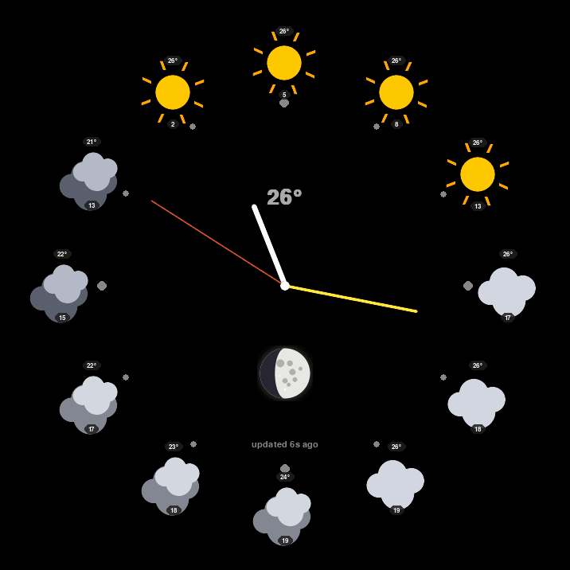

# pi-weather-clock

> Analog clock for Raspberry Pi Zero W with HyperPixel 4.0 Square that displays weather forecasts where the hours would normally be. Optimized for stability and longevity in kiosk mode.




## What it does

This is an analog clock face where each hour position on the dial shows the forecasted weather for that hour of the day. Tap an hour to see detailed info (temperature, wind, precipitation). Swipe vertically for a weekly outlook and, when there are active weather warnings, a dedicated alerts report. Includes an astronomically-accurate moon phase indicator.

It runs as a kiosk on a Pi Zero W with HyperPixel 4.0 Square (720×720 touchscreen) using **pure SDL2 KMSDRM** — no X server, no desktop environment, no Wayland. Just the framebuffer, direct hardware acceleration, and ~130MB of RAM.

### Screenshots

See the demo above. *(Add your own photos in `docs/screenshots/`.)*

## Credits & origin

This project is heavily inspired by [**KeepThisTicket/weatherClock**](https://github.com/KeepThisTicket/weatherClock) — the original concept, dial layout, and enclosure design are his. This is a substantial rewrite (5700+ lines vs ~400 of the original) focused on Pi Zero W stability and visual polish, but the core idea is his vision.

**Original repository**: https://github.com/KeepThisTicket/weatherClock
**Original enclosure CAD**: linked from the original repo

If you want to print the case, get the STL files from KeepThisTicket's repository. I don't redistribute them here.

## Features compared to original

- **Pure SDL2 KMSDRM**: no X server, ~3× lower RAM usage
- **27-30 FPS stable** on Pi Zero W with smooth seconds hand
- **Astronomically accurate moon phase** (uses OpenWeatherMap API value directly)
- **Animated weather icons** (procedural drawers + optional Meteocons theme)
- **Watchdog supervisor** with crash recovery and graceful boot screens
- **Read-only filesystem** ready (extends SD card lifespan dramatically)
- **Touch gestures**: tap an hour, swipe vertically through the HANDS → alerts → weekly carousel
- **Weather alerts report**: tap the alert banner or swipe to a full read-only list of active OpenWeather alerts, with drill-in to the complete official text
- **Fade and slide transitions** between modes (configurable easing)
- **Anti-aliased clock hands** with 8× supersampling
- **Configurable**: ~50 settings exposed via `settings.json`
- **Hot-reload**: edit `settings.json` and changes apply without restart
- **Kiosk-grade hardening**: udev silenced, audio HDMI disabled, services trimmed

## Hardware required

### Mandatory
- **Raspberry Pi Zero W** (classic) OR **Raspberry Pi Zero 2 W** (faster, recommended)
- **HyperPixel 4.0 Square** (720×720 DPI touchscreen by Pimoroni)
- **microSD card**, 16 GB+, class 10 or better (A2 endurance class recommended)
- **5V power supply**, 2A+
- WiFi connectivity (for weather data fetching)

### Optional
- 3D printed enclosure (download STL from [original repo](https://github.com/KeepThisTicket/weatherClock))
- UPS HAT (e.g. PowerWalker, PiSugar) for clean shutdowns

### Hardware notes
- Tested extensively on Pi Zero W classic (BCM2835, single-core ARMv6, 512MB RAM)
- Pi Zero 2 W works even better (quad-core ARMv8, same 512MB RAM)
- HyperPixel 4.0 Square is the only fully tested display — other DPI panels may work but require config tweaks
- Pi 3/4/5 will work but are massive overkill for this app

## Quick start

```bash
# 1. Flash Raspberry Pi OS Lite (32-bit for Zero W classic, 64-bit for Zero 2 W)
#    Use Raspberry Pi Imager. Pre-configure SSH + WiFi via the advanced
#    settings (gear icon) before flashing.

# 2. SSH into your Pi
ssh pi@raspberrypi.local

# 3. Clone and install
git clone https://github.com/luchmedia/pi-weather-clock.git
cd pi-weather-clock
sudo ./install.sh

# 4. Reboot
sudo reboot
```

After reboot you'll see the splash screen, then the clock. Total install time: ~10-15 minutes including the reboot.

## Configuration

The installer will prompt you for:

- **OpenWeatherMap API key** — get a free one at https://openweathermap.org/api/one-call-3 (the OneCall API)
- **Latitude / longitude** — your location coordinates
- **Language** — defaults to English; set to "it", "fr", "de", "es" etc. for localized weather descriptions

After install you can tune ~50 more settings in `/home/kiosk/weatherClock/settings.json`. See [docs/CONFIGURATION.md](docs/CONFIGURATION.md) for a complete reference.

Quick edit:
```bash
sudo -u kiosk nano /home/kiosk/weatherClock/settings.json
sudo wc-ctl restart
```

The app supports hot-reload for many settings — most changes apply without needing a restart.

## Management

After install, you have these commands available:

```bash
sudo wc-ctl status      # show app status, RAM, temperature
sudo wc-ctl start       # start the kiosk
sudo wc-ctl stop        # stop it
sudo wc-ctl restart     # restart
sudo wc-ctl logs        # tail the log
```

And for system tuning:
```bash
sudo wc-optimize        # disable unneeded services to save RAM/CPU
```

## Architecture

See [docs/ARCHITECTURE.md](docs/ARCHITECTURE.md) for technical details on:
- The SDL2 KMSDRM render pipeline
- Signature-based redraw skipping (saves 80% CPU when idle)
- Texture pre-build and GPU caching strategy
- The boot sequence (firmware → kernel → bash_profile watchdog → Python)
- Why we disable HDMI audio (and how)

## Read-only filesystem (recommended)

For longevity of your SD card, switch the system to read-only mode after install is complete:

```bash
sudo bin/readonly-toggle.sh enable
```

This puts `/` on an overlay filesystem (any writes go to RAM and are discarded on reboot). The app continues to work because its writable data lives in tmpfs paths.

To make config changes later, temporarily disable:
```bash
sudo bin/readonly-toggle.sh disable
# (edit files)
sudo bin/readonly-toggle.sh enable
```

See [docs/READONLY.md](docs/READONLY.md) for details and tradeoffs.

## Troubleshooting

Common issues and fixes are in [docs/TROUBLESHOOTING.md](docs/TROUBLESHOOTING.md). The top ones:

| Symptom | Likely cause | Quick fix |
|---|---|---|
| Black screen, app crashes with `EGL not initialized` | Missing GPU libraries | `sudo apt install --reinstall libgles2 libegl1 libgbm1` |
| App crashes with `pygame.error: kmsdrm not available` | TTY ownership issue or running over SSH | Must run from `/dev/tty1` via getty autologin |
| Black screen, no clock visible | `display_auto_detect=0` set | Must be `=1` for HyperPixel |
| `udev` running constantly, system slow | HDMI audio polling | Apply `/etc/modprobe.d/disable-hdmi-audio.conf` (installer does this) |
| Crash loop at boot | Multiple Python processes fighting for DRM | Reboot; installer adds anti-duplicate check |

## Customization

### Themes
Two icon themes are available out of the box:
- **Procedural** (default): icons drawn at runtime via SDL2 primitives — small, sharp, fast
- **Meteocons**: download SVG icons from [basmilius/meteocons](https://github.com/basmilius/meteocons) and rasterize them — more detailed look

```bash
# Switch to Meteocons theme
sudo apt install -y librsvg2-bin
sudo -u kiosk bash bin/download-meteocons.sh /home/kiosk/weatherClock/theme_meteocons
sudo -u kiosk python3 -c "
import json
p='/home/kiosk/weatherClock/settings.json'
d=json.load(open(p)); d['theme']='theme_meteocons'
json.dump(d, open(p,'w'), indent=2)
"
sudo wc-ctl restart
```

### Colors, fonts, animations
All configurable via `settings.json`. See [docs/CONFIGURATION.md](docs/CONFIGURATION.md).

## Performance reference (Pi Zero W classic)

| Metric | Value |
|---|---|
| Idle RAM (app RSS) | ~130 MB |
| Idle CPU | ~5-10% |
| Frame rate | 27-30 FPS sustained at 60 FPS target |
| Temperature | ~48°C ambient, ~55°C under load |
| Boot time (power → clock visible) | ~45-60 seconds |
| Disk writes (with read-only FS) | ~0 KB/hour |

## Development

To work on the code, see [docs/DEVELOPMENT.md](docs/DEVELOPMENT.md).

Want to contribute? Open an issue or PR at https://github.com/luchmedia/pi-weather-clock

## License

This project (the codebase in `src/`, the installer, scripts, and documentation) is licensed under **GPL v3**. See [LICENSE](LICENSE).

The original concept and enclosure design by KeepThisTicket (linked above) are not redistributed here — please respect his project's terms.

## Acknowledgments

- **[KeepThisTicket](https://github.com/KeepThisTicket)** — original weatherClock concept, dial layout, and 3D-printable enclosure design
- **[Basilius Milius (basmilius)](https://github.com/basmilius)** — Meteocons icon set (optional theme)
- **[Pimoroni](https://shop.pimoroni.com/products/hyperpixel-4-square)** — HyperPixel 4.0 Square display
- **[OpenWeatherMap](https://openweathermap.org)** — weather data API
- The Raspberry Pi Foundation and the SDL2 / pygame communities

---

*Made on a winter weekend that turned into a multi-month project.*
